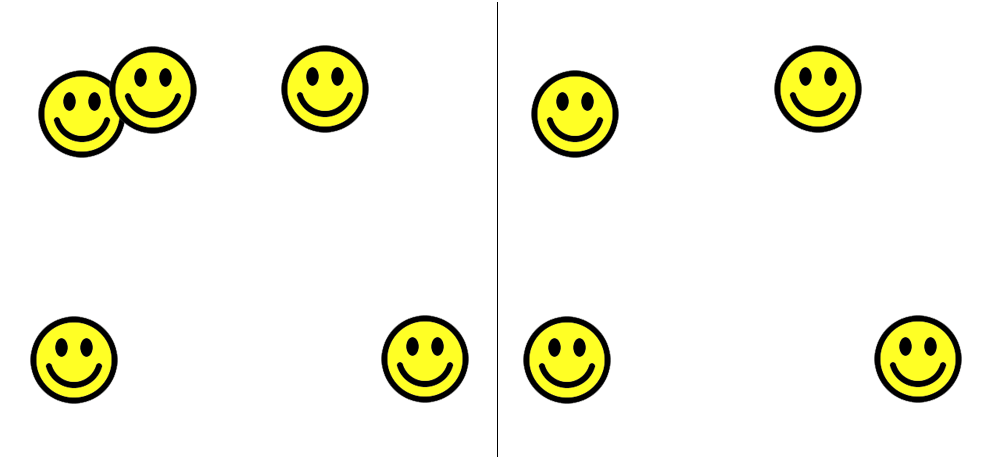
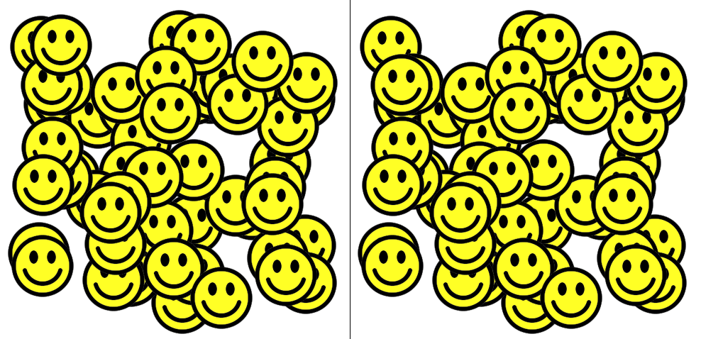

**Test exercise for front-end developers**

У цьому завданні вам буде потрібно створити гру, не використовуючи жодних фреймворків (тіки чисті HTML5, Javascript, CSS). 

Смайлик для виконання завдання 

Коли гра запускається, 5 смайликів генеруються зліва і 4 смайлики з правої сторони від розмежовувальної лінії:

Ліва і права сторони є ідентичними, але зліва на 1 смайлик більше. Користувач має знайти зайвий смайлик зліва і клікнути по ньому. Якщо він клікнув на невірний смайлик то гра завершується. Якщо ж користувач клікнув по зайвій картинці, то гра переходить на новий рівень (всі смайлики з обох сторін видаляються і нова група смайликів у рандомних позиціях має згенеруватися, у новому сеті має бути на 3 смайлики більше ніж у попередньому рівні і знову ж зліва на 1 смайлик більше).

**Code overview**

The text instructions are handled by simple HTML. 

Two *div* elements are included in the *body*, like this:

    

    

The first div is used to store all the faces shown on the left side. 

The second div is used to store all the faces shown on the right side.

The line shown in the middle of the web page is created by applying a style rule which tells the browser to show a border line for only the left side of the *secondOne* div.

The faces are dynamically created by JavaScript. First, all the faces are generated on the left side, under the div with id="firstOne”. Then all the faces from ‘firstOne’ div must be copied to the div with id ‘secondOne’, so there is an exact copy. The last child in this new div is then deleted, so that when the user looks at the screen there is one extra face on the left side compared to the right side.

The event handling is also applied by JavaScript.

There are two event handlers: 

1. One *onclick* event handler is applied to the extra face on the left side which the user needs to click on. When the event is triggered a variable containing the number of faces to be generated is increased by 3, and then the process of generating and displaying the faces begins again.Remember to use stopPropagation() method. It is necessary in order to ensure that the event does not also get applied to other elements in the web page, such as other faces. That would trigger the function multiple times, which is not what we want. 

2. The second *onclick* event handler is applied to the body. If this function is triggered, it means the player has failed to select the correct face and the game is over. When this event is triggered an appropriate message is shown and the two event handler functions are removed.

